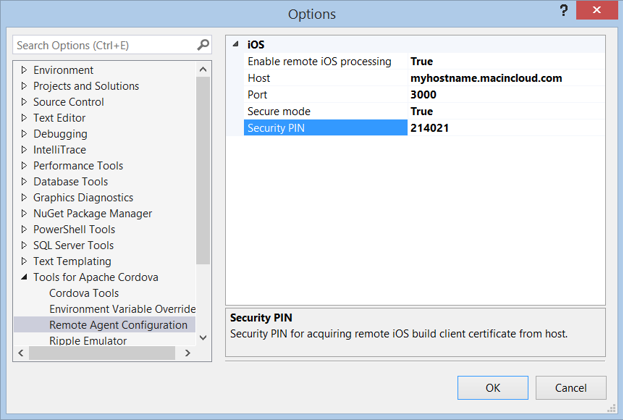
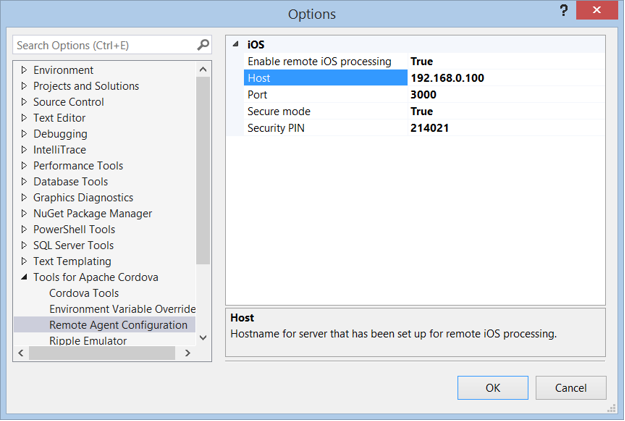

<properties
   pageTitle="Build and simulate a Cordova iOS app in the cloud | Cordova"
   description="description"
   services="na"
   documentationCenter=""
   authors="Mikejo5000"
   tags=""/>
<tags
   ms.service="na"
   ms.devlang="javascript"
   ms.topic="article"
   ms.tgt_pltfrm="mobile-multiple"
   ms.workload="na"
   ms.date="09/10/2015"
   ms.author="mikejo"/>

# Build and simulate a Cordova iOS app in the cloud

Visual Studio Tools for Apache Cordova allow you to build cross-platform, multi-device hybrid apps using [Apache Cordova](http://cordova.apache.org). You can use the remotebuild agent with a Mac on your network to build, debug, run, and simulate an iOS version of your app. Many developers start their hybrid app development by testing on Android. Later in the development process, when the focus is mainly on verifying and polishing the UI for a set of core devices, they begin testing on iOS. The need to provide each developer on a team with a Mac for this final step is not cost effective. As an alternative to buying Macs, you can use a cloud hosting provider to build and debug your app in the iOS Simulator from a Windows machine, to debug native problems using Xcode, and to submit your app to iTunes using the Apple Application Loader. Cloud hosting providers charge a range of rates, some of which can be very cost effective (particularly if the majority of your development is done on a different platform). In this tutorial, we will describe how to configure Tools for Apache Cordova for use with one provider—[MacInCloud](http://www.macincloud.com).


>**Note**: The steps shown here can be followed with other Mac hosting providers or with Macs in your own cloud facing datacenter. We recommend that you evaluate providers based on your organization’s needs.  

## Install remotebuild

To get started with MacInCloud, first set up either an account or a trial version. Make sure you enable the remote build port feature during checkout. Once you have provided your login information, connect to your Mac using Remote Desktop, and then you can set up [remotebuild](http://go.microsoft.com/fwlink/?LinkId=618169). If you chose a MacInCloud plan with a dedicated server, you may have sudo (Administrator) access. With sudo access, just follow the same instructions used to [install the remote agent](install-vs-tools-apache-cordova.md#ios) on an on-premise Mac. If you are using a managed server plan, you will not have sudo access. However, it is worth noting that remotebuild is probably already installed on the machine that you have access to. You can validate this by attempting to start up the agent. In the Terminal App, type:

     remotebuild

If it is not installed, contact MacInCloud support and ask them to install it on your behalf.

## Configure Visual Studio to connect to your cloud hosted Mac

With one exception, you can use the same process to configure Visual Studio for use with MacInCloud as you do with your own Mac. The host name for MacInCloud is not available externally, so you can either override the host name used by the agent or use an IP address instead.

>**Note**: remotebuild is not intended to be used as a traditional cloud-based service and you should make sure that you are in compliance with any Apple licensing terms that apply to your organization.  

### Option 1: To override the host name and configure Visual Studio

1. Verify whether MacInCloud has already pre-configured your managed server for use with the remotebuild agent. If it is already pre-configured, a RemoteBuild.config file will already exist in your home directory and your agent is ready for use! To verify whether it is present and configured correctly, follow these steps.

2. In the Terminal app on your MacInCloud server, try to open the file in Xcode by executing the following command.

  ```
  open -a Xcode ~/.taco_home/RemoteBuild.config
  ```

  If the file exists, it will open in Xcode.

3. If the previous command tells you the file does not exist, run the following commands in the Terminal app.

  ```
  mkdir ~/.taco_home
  echo "" >> ~/.taco_home/RemoteBuild.config
  open –a Xcode ~/.taco_home/RemoteBuild.confg
  ```

  Xcode starts with the config file open.

4. Once RemoteBuild.config is open, verify that, at minimum, the following content is present in the file:

  ```
  {
      "hostname":" myhostname.macincloud.com"
  }
  ```

  and verify that the host name has been substituted with the host name you use to connect to MacInCloud. Any command line option can be specified this way in the config file, so you can also use this method to modify other settings such as the port used. Type remotebuild help to see a complete list of commands. Save the file if you make changes.

5. After you verify the configuration, type the following command in the Terminal App on your Mac, substituting the host name for the one you use to connect to MacInCloud. .

  ```
  remotebuild resetServerCert
  remotebuild generateClientCert
  ```

  Press “Y” and press Enter is prompted. You will now see the following information.

  

6. If it is not already running, start the agent in the Terminal App on your Mac by typing:

  ```
  remotebuild
  ```

7. In Visual Studio, open **Tools**, **Options**, **Tools for Apache Cordova**, and then **Remote Agent Configuration**.

8. Configure remote agent settings, mirroring the settings shown in the Terminal App.

  >**Important**: The Security PIN expires after 10 minutes by default. To generate a new PIN, see our [documentation](configure-vs-tools-apache-cordova.md#IosPin).

  

  That’s it. You are finished configuring the agent!

Instead of overriding the host name, you may instead use the IP address of your MacInCloud server.

### Option 2: To get your IP address and configure Visual Studio

1. In the Terminal App on your Mac, type the following command (make sure you include a space before the final quotation mark, as shown).

  ```
  ifconfig | grep "inet "
  ```

2. Two IP addresses are displayed. In the steps that follow, you will need the IP address that is not the loopback address (127.0.0.1). For example, if typing the preceding command resulted in the following output, you will need 192.168.0.100.

  ```
  inet 127.0.0.1 netmask 0xff000000
  inet 192.168.0.100 netmask oxffffff00 broadcast 192.168.0.1
  ```

3. If it is not already running, start the agent in the Terminal App on your MacInCloud server by typing the following command.

  ```
  remotebuild
  ```

  The first time you start the agent, you will see output similar to this.

  

4. If you do not see this information, type the following to generate a new PIN:

  ```
  remotebuild generateClientCert
  ```

  Be sure to restart the agent after generating the PIN if you shut it down.

5. In Visual Studio, open **Tools**, **Options**, **Tools for Apache Cordova**, and then **Remote Agent Configuration**.

6. Configure remote agent settings.

  Set **Enable remote iOS processing** to **True**, and configure Port and Security PIN using the output from the Terminal App. Instead of using the host name shown in the Terminal App, use the IP address you obtained previously and enter it in the Host field.

  Using an IP address to configure VS:

  

  That’s it. You are finished configuring the agent!
