<properties
   pageTitle="Get started with CodePush and Apache Cordova | Cordova"
   description="Get started with CodePush and Apache Cordova"
   services="na"
   documentationCenter=""
   authors="davidsalgado"
   tags=""/>
<tags
   ms.service="na"
   ms.devlang="javascript"
   ms.topic="article"
   ms.tgt_pltfrm="mobile-multiple"
   ms.workload="na"
   ms.date="03/04/2016"
   ms.author="davidsalgado"/>

# Get started with CodePush and Apache Cordova

**[CodePush](http://microsoft.github.io/code-push/index.html)** is a cloud service that enables Cordova and React Native developers to deploy mobile app updates directly to their users’ devices. It works by acting as a central repository that developers can publish certain updates to (e.g. JS, HTML, CSS and image changes), and that apps can query for updates from.

CodePush provides two different tools:

- [Management CLI](http://microsoft.github.io/code-push/docs/cli.html): NodeJS-based CLI used to manage your CodePush suscription. You can use this tool to create a CodePush account and to create and manage your app updates.

- Client SDK: Used to add CodePush integration to your mobile app. Use the [Cordova Plugin for CodePlush](http://microsoft.github.io/code-push/docs/cordova.html) to integrate CodePush in a Cordova application. Check the [CodePlush documentation](http://microsoft.github.io/code-push/docs/getting-started.html) for integration with other client application types.

In this guide you will see how to integrate CodePlush in an existing sample Cordova application and how to use it to release an update.


## <a id="setup"></a>Prerequisites

To complete this guide you will need: 

- The [Cordova CLI](https://cordova.apache.org/docs/en/latest/guide/cli/index.html), which will be used to build the Cordova application.

- During this guide we will use Visual Studio Code as the development environment, but you can use any code editor you prefer. To use Visual Studio Code you will need:

    - [Visual Studio Code](https://code.visualstudio.com/)

    - [Cordova Tools extension for Visual Studio Code](https://marketplace.visualstudio.com/items?itemName=vsmobile.cordova-tools)

- In order to run this guide on OS X, make sure you have [Xcode](https://itunes.apple.com/us/app/xcode/id497799835?mt=12) 6.0 (or higher) installed in your Mac. The iOS SDK, included with Xcode, contains the iPhone Simulator that will be used through this guide to deploy the samples. For debugging iOS on Visual Studio Code you will also need:

    - [HomeBrew](http://brew.sh/)

    - [ideviceinstaller](https://github.com/libimobiledevice/ideviceinstaller)

    - [iOS WebKit Debug Proxy](https://github.com/google/ios-webkit-debug-proxy)

> **Note:** Users following this guide using Windows, won't be able to deploy applications to iOS. For information about requirements to deploy Cordova apps for Android follow the instructions described in the [Apache Cordova Android Platform Guide](https://cordova.apache.org/docs/en/latest/guide/platforms/android/).

## <a id="setup"></a>Setup

Before you can release any updates you need to create a CodePush account and register your application. CodePush provides a CLI to perform this operations.

1. Install the **CodePush CLI** in your development machine by executing the following command in a new Terminal:

    ```shell
    sudo npm install -g code-push-cli
    ```
    
    > **Note:** Remove the ```sudo``` if you are using Windows.

    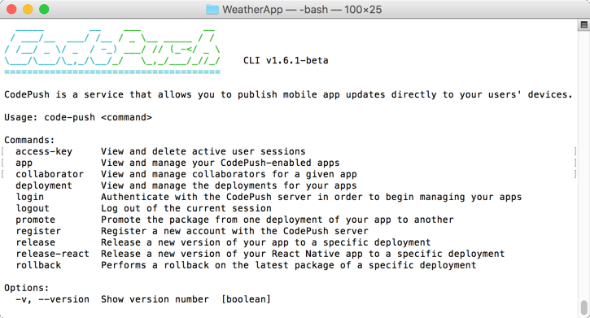

1. Setup your CodePush account by following these steps. You can read more about it in the [Getting started](http://microsoft.github.io/code-push//docs/getting-started.html) guide:

    1. Execute the following command to create a CodePush account
    
        ```shell
        code-push register
        ```
        
        If you are already registered run this command instead to log in:
        
        ```shell
        code-push login
        ```
        
        > **Note:** When you login from the CLI, your access token (similar to a cookie) is persisted to disk so that you don’t have to login everytime you attempt to access your account. In order to delete this file from your computer, simply run the following command:
        >
        >```shell
        >code-push logout
        >```
        >
        > For more information about CodePush authentication, check the [CodePush CLI documentation](http://microsoft.github.io/code-push/docs/cli.html#authentication).
        

1. Register the app by executing the following command:

    ```shell
    code-push app add weather-app-ios
    ```
    
    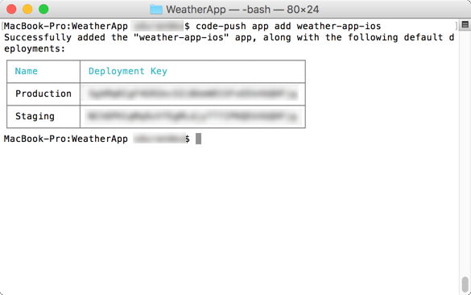
        
    > **Note:** It's recommended to use a different CodePush apps for every platform. For example, use ```code-push app add weather-app-android``` to register an Android version of your app.
    
    Take note of the keys returned. For this guide you will use the **Staging** key. 
    
1. Get the the sample Weather App. This app is explained in greater detail in the [Visual Studio Code and Cordova getting started](get-started-vs-code-cordova-tools-extension.md) document. It will be used through this guide to show how CodePush can be integrated in an existing application.

    1. Download the **WeatherApp** code from [here](https://github.com/Microsoft/cordova-samples/tree/master/weather-app/WeatherApp) to a local folder. If you cloned the entire repo, find the project folder in ```weather-app/WeatherApp```.
    
    1. This Cordova application has only the Android platform configured. Add the iOS platform by executing the following command in a Terminal window opened in the location where the sample app was downloaded.
    
        ```shell
        cordova platform add ios
        ```
    
    1. Execute the following command to remove the Android platform as it won't be used in this guide.
    
        ```shell
        cordova platform remove android
        ```

## <a id="prepare"></a>Prepare your app

The next step to send application updates to the the users' devices using CodePush is to implement the CodePush SDK in your app.   

1. Open a Terminal located at your Cordova application's root folder.

1. Run this command to install the [CodePush plugin](https://github.com/Microsoft/cordova-plugin-code-push) for Cordova.

    ```shell
    cordova plugin add cordova-plugin-code-push
    ```

1. Open the project either by opening the folder where the application was created in Visual Studio Code or by running the following command in the Terminal window:

    ```shell
    code .
    ```

    > **Note:** Mac and Linux users should follow additional steps to run Visual Studio Code from the Terminal as shown above. Refer to [this](https://code.visualstudio.com/Docs/editor/setup) article for details.

1. In Visual Studio Code, open the ```config.xml``` file and add the following code, first replacing your key value with your CodePush app Staging deployment key:
    
    ```xml
    <platform name="ios">
        <preference name="CodePushDeploymentKey" value="YOUR-IOS-DEPLOYMENT-KEY" />
    </platform>
    ```

    > **Note:** To obtain the keys configured for a given app run the following command:
    >```shell
    >code-push deployment list weather-app-ios -k
    >```
     
1. Add the CodePush server URL to your app Content-Security-Policy meta tag. This ensures your app can access the CodePush server.   Open the ```index.html```, locate the ```Content-Security-Policy``` tag and add the following URL to it: https://codepush.azurewebsites.net.  
    
    Your CSP tag should look like similar to the following code:
    
    ```html
    <meta http-equiv="Content-Security-Policy" content="default-src 'self' data: gap: https://ssl.gstatic.com https://query.yahooapis.com http://gws2.maps.yahoo.com http://l.yimg.com https://codepush.azurewebsites.net 'unsafe-eval'; style-src 'self' 'unsafe-inline'; media-src *">
    ```
    
    > **Note:** Content Security Policy (CSP) is a computer security standard introduced to prevent cross-site scripting (XSS), clickjacking and other code injection attacks resulting from execution of malicious content in the trusted web page context. For more information visit http://content-security-policy.com/
        
    You are now ready to use the plugin in the application code.        

     > **Note:** CodePush requires the Crodova ```Whitelist``` plugin to work properly. It's included by default in Cordova applications. Also if you have overridden the Cordova's default security policy, by removing the ```<access origin="*" />``` element from your ```config.xml``` file you will need to add the following additional ```<access />``` elements to ensure that your app can access the CodePush server endpoints:
     > ```xml
     > <access origin="https://codepush.azurewebsites.net" />
     > <access orogin="https://codepush.blob.core.windows.net" />
     > ```
     
1. Open the ```index.js``` file and add the following code to your ```onDeviceReady``` function:
    
    ```javascript
    codePush.sync();
    ```
    
    The ```sync``` method is the simplest way to add CodePush to your app. If an update is available, it will be silently downloaded, and installed the next time the app is restarted (either explicitly by the end user or by the OS), which ensures the least invasive experience for your end users.
    
    We will see a more advanced example of this method to perform a customized update experience in the [Advanced application update with CodePush](#advanced) section.
    
## <a id="deploy"></a>Deploy the application

Before learning how to release a change with CodePush we need to deploy the original version of the application to the client devices.

Visual Studio Code allows you to deploy and debug Cordova applications easily. This section shows how to configure it to deploy and debug the sample application we are using. If you don't want to debug you can just run the following command in the Terminal window to deploy the application:

```shell
cordova run ios
```

   > **Note:** For information about deploying Cordova applications in other platforms see the [Cordova documentation](https://cordova.apache.org/docs/en/latest/guide/overview/).

1.  In Visual Studio Code click on the Debugging icon in the View Bar to bring up the Debug view.

1.  Click on the Configure gear icon on the top bar and choose the **Cordova** debug environment.

    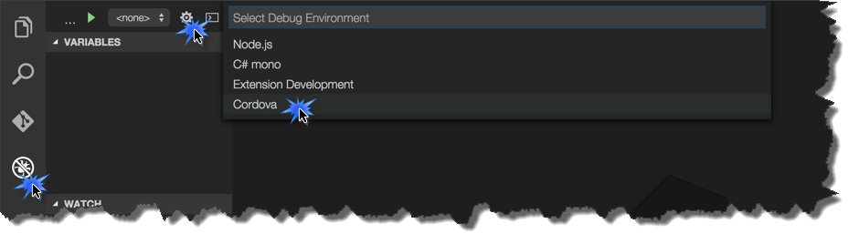
    
1.  Select the configuration named **Run iOS on simulator** using the **Configuration dropdown**.

    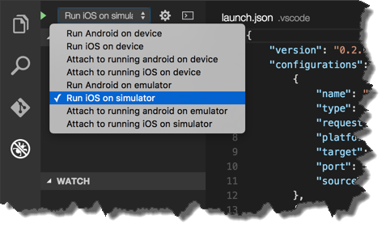

1.  Click on the **Start** button (or hit ```F5```) to start the debugger.

    > **Note:** If you are facing troubles running the simulator check the [Get started with Visual Studio Code and Apache Cordova troubleshooting section](get-started-vs-code-cordova-tools-extension.md#troubleshooting) section.

    You can also run the application in any of the configuration options available for the Cordova environment, including simulators and devices. Check the following guides for instructions on how to setup your environment to run Cordova applications in the different supported platforms:

    -   [iOS Platform Guide](https://cordova.apache.org/docs/en/latest/guide/platforms/ios/)
    -   [Android Platform Guide](https://cordova.apache.org/docs/en/latest/guide/platforms/android/)

1. Switch back to Visual Studio Code and stop the debugger.

    The application is now deployed in your iOS simulator, you can launch it from the simulator without using the Visual Studio Code debugger.
    
1. Close the application in the simulator.

## <a id="change"></a>Release a change

Now that the first version of your app with CodePush has been deployed to your client devices we will see how the changes you release are automatically updated in the client devices using CodePush.

1. In Visual Studio Code open the ```index.html``` page and change the title of the application. Look for this line:

    ```html
    <h1>Weather App</h1>
    ```
    
    And replace its content with this title:
    
    ```html
    <h1>Weather App (v1)</h1>
    ```
    
1. Now, to update the application in your client devices, instead of running it from Visual Studio Code, you will just build the application with Cordova and let CodePush handle the update process in the devices. 

    Build your app using one of the Commands provided by the Cordova Tools extension for VS Code. Hit ```F1``` to open the VS Code Command Palette, type ```Cordova``` and then pick **Cordova: Build** (or hit ```Cmd```+```Shift```+```B```).

    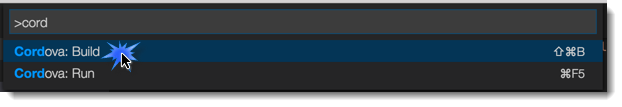
    
    > **Note:** ```cordova prepare``` is enough for this step. If you prefer, you can execute that command in a Terminal window in case you are not using Visual Studio Code.
    
1. Once the application has been built, release the updated code to the CodePush server using the CodePush CLI. In the Terminal window at your project's root folder run the following command:

    ```shell
    code-push release weather-app-ios platforms/ios/www <targetBinaryVersion> --deploymentName Staging
    ```
    
    Where ```<targetBinaryVersion>``` parameter needs to be set to the exact value of the ```<widget version>``` attribute (e.g. 1.0.0) in your config.xml file:
    
    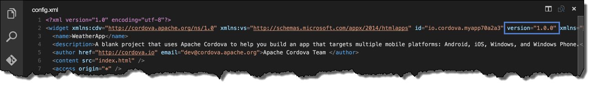
    
    > **Note:** Check [this document](http://microsoft.github.io/code-push/docs/cordova.html#releasing-updates) for instructions on how to release updates to other platforms.
    
1. You can see the deployment you just created using the following CodePush CLI command:

    ```shell
    code-push deployment ls weather-app-ios
    ```
    
    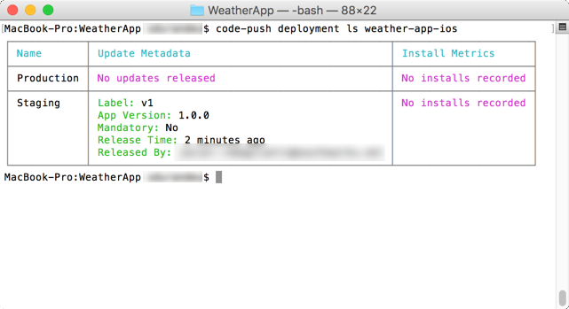
    
    As you just created the deployment, there are no installs recorded.
    
1. Switch to the simulator where you deployed the first version of the app and open it. When the app is initialized, a call to the CodePush server is performed. It detects that a new version is available and downloads it. By default, new versions are installed on the next restart, so you won't see the changes until you restart the application on the simuator/device. 

1. Check the status of the deployment by running the same command:

    ```shell
    code-push deployment ls weather-app-ios
    ```

    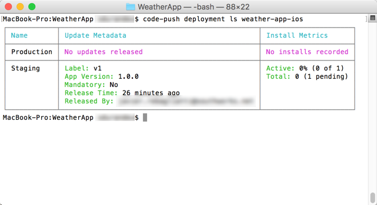

    Notice that the version downloaded by your device is registered in CodePush and labeled as **Pending**, since it hasn't been installed yet.
    
    > **Note:** Installation mode can be changed by passing options to the ```sync``` method. Refer to the [API documentation](http://microsoft.github.io/code-push/docs/cordova.html#syncoptions) for more information.
    
1. Restart the application in the simulator/device. You will see that the app has been updated to the new version (v1 should bd displayed in the title):

    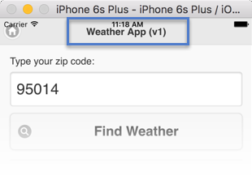

    However, if you check the status of the deployment in CodePush, you will see that it is still pending. Only when you restart the application again (and another call to CodePush ```sync``` method is performed), the status of the deployment will be updated in CodePush.
    
1. Restart the application and execute the following command. Notice that the total value is now 1.

    ```shell
    code-push deployment ls weather-app-ios
    ```

    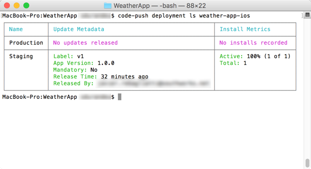


## <a id="advanced"></a>Advanced application update with CodePush

The previous example showed the easiest way to implement the CodePush SDK in your application by handling the application updates silently, with no interaction with the user.
    
In most of the cases, the default approach is fine, since it ensures the least invasive experience for your end users. But sometimes, the update experience has to be customized. In this section you will see how to use the CodePush API to show information about the update process.

If you would like to display a confirmation dialog (an "active install"), or customize the update experience in any way, refer to the [sync method's API reference](http://microsoft.github.io/code-push/docs/cordova.html#codepushsync) for information on how to tweak this default behavior.

For this example, the Weather app footer will be used to show information about the update process.

1. Open the **index.html** file in Visual Studio Code and locate the footer:

    ```html
    <div data-role="footer" data-position="fixed">
        <h4>Visual Studio Tools for Cordova Demo</h4>
    </div>
    ```
    
1. Add **syncStatus** as the ID for the ```<hr>``` element:

    ```html
    <h4 id="syncStatus">Visual Studio Tools for Cordova Demo</h4>
    ```

1. Open the **index.js** file and add the following method:

    ```javascript
    function onStatusChange(syncStatus) {
        var message;
        switch (syncStatus) {
            // Result (final) statuses
            case SyncStatus.UPDATE_INSTALLED:
                message = "The update was installed successfully. Restart.";
                break;
            case SyncStatus.UP_TO_DATE:
                message = "The application is up to date.";
                break;
            case SyncStatus.UPDATE_IGNORED:
                message = "The user decided not to install the optional update.";
                break;
            case SyncStatus.ERROR:
                message = "An error occured while checking for updates";
                break;

            // Intermediate (non final) statuses
            case SyncStatus.CHECKING_FOR_UPDATE:
                message = "Checking for update.";
                break;
            case SyncStatus.AWAITING_USER_ACTION:
                message = "Alerting user.";
                break;
            case SyncStatus.DOWNLOADING_PACKAGE:
                message = "Downloading package.";
                break;
            case SyncStatus.INSTALLING_UPDATE:
                message = "Installing update";
                break;
        }
        $("#syncStatus").text(message);
    };
    ```

1. Replace the ```codePush.sync()``` call with this one:

    ```javascript
    codePush.sync(onStatusChange);
    ```
    
    ```onStatusChange``` is the callback function to be called with the status of the sync operation. It will be called at least one time with an intermediate status, and only one time (the final call) with a result status.

1. Use the same steps from the previous section to update your client devices with the new code:

    1. Build the code using ```cordova build``` or ```cordova prepare```.
    
    1. Run the following command in a Terminal window to create a new release: ```code-push release weather-app-ios platforms/ios/www <targetBinaryVersion> --deploymentName Staging```.
    
    1. Restart the application in your device twice (first time to download the update and the second to install it).
    
    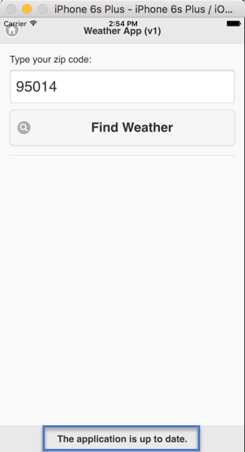
    
    Now that the application is updated, lets create another deploy and see how the app manages it. In this update we'll remove the hardcoded "v1" from app title and replace it with the current version label, from CodePush API.
    
1. Add the following method to the **index.js** file:

    ```javascript
    function onPackageSucces(localPackage) {
        if (localPackage) {
            $("#app-title").text("Weather App (" + localPackage.label + ")");
        }
    };
    ```
    
1. And add the call to the ```getCurrentPackage``` method in the ```onDeviceReady``` function:

    ```javascript
    codePush.getCurrentPackage(onPackageSucces);
    ```
    
1. Create a new update repeating the same steps and restart the application in your user devices twice to get the latest changes:

    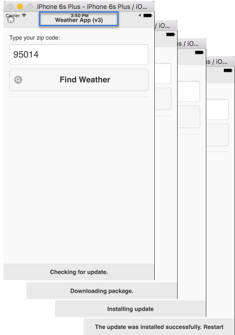

    
## <a id="next-steps"></a>Next Steps

You've finished deploying mobile app updates using CodePush, applying both the default and custom behaviors. The following list contatins a set of resources you can explore to get a better understanding of the service:

- A more Advanced Cordova CodePush Sample application, showing how to implement a more complex update experience, including promting the user to install the update: See [Cordova CodePush Sample App - Advanced](https://github.com/Microsoft/cordova-plugin-code-push/tree/master/samples/advanced)

- Work with other developers on the same CodePush app: See [App Collaboration](http://microsoft.github.io/code-push/docs/cli.html#app-collaboration) 

- Roll back undesired updates: See [Using the rollback command](http://microsoft.github.io/code-push/docs/cli.html#rolling-back-undesired-updates)

- Promote updates across deployments: See [Using the promote command](http://microsoft.github.io/code-push/docs/cli.html#promoting-updates-across-deployments)