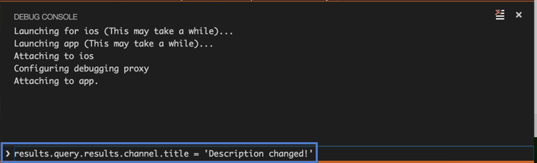

<properties
   pageTitle="Get started with Visual Studio Code and Apache Cordova | Cordova"
   description="Get started with Visual Studio Code and Apache Cordova"
   services="na"
   documentationCenter=""
   authors="davidsalgado"
   tags=""/>
<tags
   ms.service="na"
   ms.devlang="javascript"
   ms.topic="article"
   ms.tgt_pltfrm="mobile-multiple"
   ms.workload="na"
   ms.date="02/23/2016"
   ms.author="davidsalgado"/>

# Get started with Visual Studio Code and Apache Cordova

[Apache Cordova](https://cordova.apache.org/) is an open-source development framework that allows you to use standard web technologies such as HTML5, CSS3, and JavaScript for cross-platform development, avoiding each mobile platforms' native development language. Applications execute within wrappers targeted to each platform, and rely on standards-compliant API bindings to access each device's sensors, data, and network status. 

[Visual Studio Code](https://code.visualstudio.com/) is a lightweight open-source code editor developed by Microsoft for Windows, Linux and OS X operating systems. It allows the developers to build and debug applications in multiple languages with rich code assistance. It is also expandable through [extensions](https://code.visualstudio.com/docs/editor/extension-gallery). The source code can be found in [GitHub](https://github.com/Microsoft/vscode), where you can contribute with fixes and features.

One of the extensions available for Visual Studio Code are the Cordova Tools Extension. These tools are also open-source and can be found in this [GitHub repository](https://github.com/Microsoft/vscode-cordova).

In this guide, you will see how to use these tools to build apps that run on iOS, Android, and Windows devices and share nearly 100% of your code. Along the way, you'll build a basic app that looks like the following image:


You can find the complete sample [here](https://github.com/Microsoft/cordova-samples/tree/master/weather-app/WeatherApp). Notice that this project has only the Android platform configured. If you are planning to run it on iOS you'll need to add the iOS platform too. Check the [Add Platforms](#add-platform) section for instructions on how to add the iOS platform to an existing Cordova project.

## <a id="prerequisites"></a>Prerequisites
In order to run this guide on OS X, make sure you have [Xcode](https://itunes.apple.com/us/app/xcode/id497799835?mt=12) 6.0 (or higher) installed in your Mac. The iOS SDK, included with Xcode, contains the iPhone Simulator that will be used through this guide to deploy the samples.

> **Note:** For more information about requirements to deploy Cordova apps for iOS check the [Apache Cordova iOS Platform Guide](https://cordova.apache.org/docs/en/latest/guide/platforms/ios/).

Users following this guide using Windows, won't be able to deploy applications to iOS. For information about requirements to deploy Cordova apps for Android follow the instructions described in the [Apache Cordova Android Platform Guide](https://cordova.apache.org/docs/en/latest/guide/platforms/android/).

## <a id="setup"></a>Setup your Environment

Before starting, make sure that you have the tools installed by following these instructions:

1. See [Setting up Visual Studio Code](https://code.visualstudio.com/Docs/editor/setup) for instructions on how to download and install Visual Studio Code in your platform.

1. Open Visual Studio Code and install the [Cordova Tools Extension](https://marketplace.visualstudio.com/items?itemName=vsmobile.cordova-tools) by following the instructions detailed next:

    1. Press ```Cmd+P``` (or ```Ctrl+P``` in Windows) to access the Quick Open Navigator and type ```ext install Cordova Tools```

        
        
    1. Pick the **Cordova Tools** from the list or press **Enter** to install the extension.
    
            
        
    1. Restart Visual Studio Code.
    
    > **Note:** For more information about Installing Extensions in VS Code check [this page](https://code.visualstudio.com/docs/editor/extension-gallery?pub=vsmobile&ext=cordova-tools).

1. Open a new Terminal/Console and run the following command to install the [Apache Cordova CLI](https://cordova.apache.org/docs/en/4.0.0/guide/cli/):

    ```shell
    sudo npm install -g cordova
    ```
        
    > **Note:** To install Cordova CLI on Windows remove the ```sudo```:
    
    >```shell
    >npm install -g cordova
    >```
    
1. Install [HomeBrew](http://brew.sh/) on your Mac. *HomeBrew* is a package manager for Mac OS X similar to Linux ```apt-get``` command.

1. Run the following command in the terminal to install [ideviceinstaller](https://github.com/libimobiledevice/ideviceinstaller) and the [iOS WebKit Debug Proxy](https://github.com/google/ios-webkit-debug-proxy):
        
    ```shell
    brew install ideviceinstaller ios-webkit-debug-proxy
    ```
    
    The *iOS WebKit Debug Proxy* is an application that allows developers to inspect UIWebViews (like the one used by Cordova) on real and simulated iOS devices via the [Chrome DevTools UI](https://developers.google.com/chrome-developer-tools/) and [Chrome Remote Debugging Protocol](https://developer.chrome.com/devtools/docs/debugger-protocol). Visual Studio Code uses it to enable the iOS application debugging, by attaching the debugger to the Proxy as a WebSocket Client, implementing the Remote Debugging Protocol.
    
    *ideviceinstaller* is a tool used by Visual Studio Code to install Cordova applications in iOS devices. This tool uses the [libimobiledevice](http://www.libimobiledevice.org/) library to communicate with the iOS devices, allowing to install, upgrade, uninstall, archive, restore and enumerate installed or archived apps.
    
> **Note:** Steps 4 and 5 are not needed if you are not planning to deploy your app in iOS.

Optionally, you can customize your workspace. Visual Studio Code provides two different scopes for settings:

- **User:** these settings apply globally to any instance of VS Code you open.

- **Workspace:** these settings are stored inside your workspace in a .vscode folder and only apply when the workspace is opened. Settings defined on this scope overwrite the user scope.

For example, if you want to change the editor tabsize for your project, but without affecting other projects opened with Visual Studio Code, follow these instructions:

1.  Open the **workspace settings** by selecting ```File```, ```Preferences```, ```Workspace Settings``` in the VS Code menu.

1.  You are provided with a list of default settings and the settings configured for your workspace (the **config.json** file). Copy the ```editor.tabsize``` setting from the default settings and paste it in your workspace settings.

1. Change the setting with the desired value and save the file.


## <a id="get-started"></a>Create a blank project

In this section you will see how to create a blank application using the Cordova CLI:

1. Open a console/terminal in the directory where you want to store your application.

1. Run the following commands to create a blank Cordova application named **WheaterApp**:

    ```shell
    cordova create WeatherApp com.example.weather WeatherApp
    cd WeatherApp
    ```
    
    

1. Open the project either by opening the folder where the application was created in Visual Studio Code or by running the following command in the Terminal window:

    ```shell
    code .
    ```

    > **Note:** Mac and Linux users should follow additional steps to run Visual Studio Code from Terminal as shown above. Refer to [this](https://code.visualstudio.com/Docs/editor/setup) article for details.
    
1. Open the Explorer view, by clicking the first icon of the View Bar on the left. The new Apache Cordova project structure is displayed.

    
    
1. Click on the **config.xml** file to see the project global configuration file. Notice how code highlighting works on an XML file.

1. Add the following element inside the ```ios``` platform tag to enable the portrait and landscapes modes on iOS:

    ```xml
    <preference name="Orientation" value="all" />
    ```
    
    Note how IntelliSense work on an XML file as you type. After the modification, iOS platform specific configuration element should look like this: 
    
    ```xml
    <platform name="ios">
        <allow-intent href="itms:*" />
        <allow-intent href="itms-apps:*" />
        <preference name="orientation" value="all" />
    </platform>
    ```

    > **Note:** Screen rotation is disabled by default for iOS (portrait only), although it's enabled for all the other platforms. See [config.xml file specification](https://cordova.apache.org/docs/en/latest/config_ref/index.html#multi-platform-preferences) for further details.

## <a id="add-platform"></a>Add Platforms

In this section you will add the different platforms currently supported by Visual Studio Code (Android and iOS) to your project.

1. Run the following command in the Terminal/Console window to add the Android platform (your Terminal/Console window should be located at the root directory of your app).

    ```shell
    cordova platform add android
    ```

1. Once it has finished, switch to Visual Studio Code and take look at the platforms folder. You will see that it has been refreshed to include the new platform you just added:

    
    
1. Switch back to the Terminal/Console window and run the following command to add the iOS platform:

    ```shell
    cordova platform add ios
    ```

    > **Note:** Visual Studio Code Cordova Tools currently support debugging apps for **Android** and **iOS** only. Although **Windows** apps can be deployed in a Windows PC, debugging is not available yet. If you want to add support for Windows Phone in your application run the following command:
    > ```shell
    > cordova platform add windows
    > ```
    

## <a id="run"></a>Run your app

In this section you will see how to deploy the Cordova Hello World application in the iOS simulator. To do so you need to setup your debugging configuration file first. 

The **launch.json** file is automatically generated by VS Code when you select a debug environment, and it contains all the debug configurations available for that environment with their corresponding settings. The **Cordova debug environment** contains settings for running Android and iOS applications in both devices and simulators/emulators, among others. 

1.  In Visual Studio Code click on the Debugging icon in the View Bar to bring up the Debug view.

1.  Click on the Configure gear icon on the top bar and choose the **Cordova** debug environment.

    
    
    After doing that, the **launch.json** file is added to your project, under the **.vscode** folder. 
    
1.  Review the generated values and make sure that they make sense for your project and debugging environment. You can add additional configurations to the *launch.json* (use hover and IntelliSense to help).

1.  Select the configuration named **Run iOS on simulator** using the **Configuration dropdown**.

    

1.  Click on the **Start** button (or hit ```F5```) to start the debug session.

    After the code is built, the iOS simulator is launched and your app is opened in the device. Check the [troubleshooting](#troubleshooting) section if you are facing problems running the simulator.

    
    
    You can also run the application in any of the configuration options available for the Cordova environment, including simulators and devices. Check the following guides for instructions on how to setup your environment to run Cordova applications in the different supported platforms:

    -   [iOS Platform Guide](https://cordova.apache.org/docs/en/latest/guide/platforms/ios/)
    -   [Android Platform Guide](https://cordova.apache.org/docs/en/latest/guide/platforms/android/)

    > **Note:** Currently, iOS applications can only be debugged on OS X Macs.

1. Switch back to Visual Studio Code and stop the debugger.

> **Note:** You should test your app on as many physical devices (running on as many Operating System versions) as you can. Emulators and Simulators can behave different than a real device on certain circumstances and respond at different speeds. For example, an app may work in the simulator without a problem, but it may fail on a real device, or it can run faster on the device compared with an emulator. More information [here](https://cordova.apache.org/docs/en/latest/guide/next/#testing-on-a-simulator-vs.-on-a-real-device).


## <a id="build-something"></a>Build a basic app

The goal of this section is to build a very basic app that shows the weather conditions of any area in the United States.

### Add External Libraries

First, you'll add the [JQuery](https://jquery.com/) and [JQuery Mobile](https://jquerymobile.com/) libraries to the project.

If you're not familiar with _JQuery_, it's a just a JavaScript library that makes certain tasks easier such as changing the properties of a control or handling it's events, and that's exactly what we'll use it for. _JQuery Mobile_ is a touch-optimized HTML5 UI framework, built on JQuery core, designed to make responsive web sites and apps that are accessible on all smartphone, tablet and desktop devices. In this tutorial is included because it provides a quick way of styling the application without having to do custom CSS work.

1.  Download the libraries files. You can either use the bash ```curl``` command, or download them manually.

    -   To download the libraries files to the corresponding location, run the following commands in the Terminal (it must be pointing to your project's root directory):

        ```bash
        curl -o www/js/jquery-2.2.1.min.js http://code.jquery.com/jquery-2.2.1.min.js
        curl -o www/js/jquery.mobile-1.4.5.min.js http://code.jquery.com/mobile/1.4.5/jquery.mobile-1.4.5.min.js
        curl -o www/css/jquery.mobile-1.4.5.min.css http://code.jquery.com/mobile/1.4.5/jquery.mobile-1.4.5.min.css
        ```

    -   If you want to do it manually, follow these instructions:

        1.  Download the _JQuery_ latest compressed version from [here](https://jquery.com/download/) and move the library JS file to the **js** subfolder of your **www** folder.

        1.  Download the _JQuery mobile_ latest zipped version from [here](https://jquerymobile.com/download/) and extract the following files:
            
            - jquery.mobile-1.4.5.min.js to the **js** subfolder of your **www** folder.
            
            - jquery.mobile-1.4.5.min .css to the **css** subfolder of your **www** folder.
    
    After adding the references the **www** folder structure should resemble the following:
    
    

1.  In Visual Studio Code Explorer view open the **index.html** file.

1.  Add this script reference to the `<body>` tag, at the bottom of the body section, where the other JavaScript references are located:

    ```html
    <script type="text/javascript" src="js/jquery-2.2.1.min.js"></script>
    <script type="text/javascript" src="js/jquery.mobile-1.4.5.min.js"></script>
    ```

1.  And this style reference to the `<head>` tag, above the existing **index.css** reference:

    ```html
    <link rel="stylesheet" type="text/css" href="css/jquery.mobile-1.4.5.min.css" />
    ```
    
    Note how IntelliSense and code highlighting work on HTML files.
    
### Design a page

**index.html** is the first page that appears when users run the app. So you'll add the HTML of the app's main page to that file. 

> **Note:** The app's default file can be changed by setting the **content** element of the config.xml file. Check [the config.xml reference](https://cordova.apache.org/docs/en/latest/config_ref/) for more information about the global configuration file. 

1. Open the **index.css** file in the Visual Studio Code editor and replace its content with the following css rules:

    ```css
    .not-displayed {
        display: none;
    }

    form {
        border-bottom: 1px solid #ddd;
        padding-bottom: 5px;
    }

    #zip-code-input {
        font-size: 25px;
    }

    #get-weather-btn {
        font-size: 22px;
    }

    #title {
        font-size: 16px;
    }

    #summary {
        font-size: 35px;
    }

    #summary img {
        float: right;
    }

    #error-msg {
        text-align: center;
        margin-top:  50%;
        font-weight: bold;    
    }
    
    #weather-page {
        margin-top: 20px;   
    }
    ```
    
1. Open the **index.html** file and replace the content of the ```<body>``` tag, with the exception of the script references in the bottom of the page, with the following HTML:

    ```html
    <div data-role="page" id="weather-page">

        <div data-role="header" class="header">
            <h1 id="app-title">Weather App</h1>
            <a href="/" class="ui-btn ui-btn-left ui-btn-corner-all ui-icon-home ui-btn-icon-notext" rel="external">Home</a>
        </div>

        <div role="main" class="ui-content">
            <form>
                <label for="zip-code">Type your zip code:</label>
                <input id="zip-code-input" name="zip-code" placeholder="eg. 98001" required />
                <button id="get-weather-btn" data-role="button" data-icon="search">Find Weather</button>
            </form>

            <ul id="weather-data" data-role="listview" data-inset="true" class="ui-listview ui-listview-inset ui-corner-all ui-shadow not-displayed">
                <li data-role="list-divider" id="title" class="ui-li-divider ui-bar-a"></li>
                <li><span id="summary"><span id="temperature"></span> F </span></li>
                <li>Wind: <span id="wind"></span> knots</li>
                <li>Humidity: <span id="humidity"></span> %</li>
                <li>Visibility: <span id="visibility"></span> miles</li>
                <li>Sunrise: <span id="sunrise"></span></li>
                <li>Sunset: <span id="sunset"></span></li>
            </ul>

            <div id="error-msg" class="not-displayed">
            </div>

        </div>

        <footer data-role="footer" data-position="fixed">
            <h4>Cordova Tools Extension for VS Code Demo</h4>
        </footer>

    </div>
    ```

### Handle a button event

1. Open the **index.js** file and replace the content of the ```onDeviceReady``` function with the following line of code:

    ```javascript
    $('#get-weather-btn').click(WeatherApp.getWeather);
	```

    This code refers to the ID of the 'Get Weather' button on the HTML page and it's used to handle the `click` event by passing in the name of a function (_getWeather_). That function will be added shortly.
    
    Notice that JavaScript IntelliSense is provided out of the box with VS Code (as well as HTML, CSS, JSON, among others). Just hit ```Ctrl+Space``` in any JS file to use it. JQuery type definition has to be downloaded to enable JQuery IntelliSense.
    
    1. Type ```$``` in your JS file and hover over the warning (green squiggly line under it), a light-bulb will appear.
    
    1. Click the light-bulb  (or hit ```Cmd+.```) and select **Download type definition jquery.d.ts** in the dropdown list.
    
        
        
    1. After the 'Successful download' confirmation message is displayed JQuery intellisense is ready to use. Type ```.``` and see it in action:
    
         
         
    VS Code provides IntelliSense for virtually all other environments through the use of type definition ```.d.ts``` files. [DefinitelyTyped](https://github.com/DefinitelyTyped/DefinitelyTyped) is a repository of typings files for all major JavaScript libraries and environments. You can just drop a new type definition ```.d.ts``` file into your project folder and VS Code will pick it up automatically.

1. Remove the ```receivedEvent``` function.

### Add code to get the weather

Now you will add the *getWeather* function to handle button's ```click``` event. But first, the JavaScript file for that function has to be created.

1. In the **Explorer** view, click the **js** sub-folder in your **www** folder.

1. Positioned in the **js** folder, click on the **New File** icon next to the project name to create a new file in the selected folder.

    


1. Name the file *weather.js*, and then hit **Enter**.

1. Add the following code to the new file:

	```javascript       
    var WeatherApp = {};

    (function ($, ns, navigator) {
        ns.getWeather = function () {
            var zipcode = $('#zip-code-input').val();

            // get weather using zip code
            var queryString =
                'https://query.yahooapis.com/v1/public/yql?q='
                + 'select+*+from+weather.forecast+where+location='
                + zipcode + '&format=json';

            $.getJSON(queryString, function (results) {
                if (results.query.count > 0 && results.query.results.channel.wind) {
                    $('#error-msg').hide();
                    $('#weather-data').show();

                    var weather = results.query.results.channel;
                    $('#title').text(weather.title);

                    var wind = weather.wind;
                    $('#temperature').text(wind.chill);
                    $('#wind').text(wind.speed);

                    var atmosphere = weather.atmosphere;
                    $('#humidity').text(atmosphere.humidity);
                    $('#visibility').text(atmosphere.visibility);

                    var astronomy = weather.astronomy;
                    $('#sunrise').text(astronomy.sunrise);
                    $('#sunset').text(astronomy.sunset);

                    $('#summary img').attr('src', $(weather.item.description)[0].src);

                } else {
                    $('#weather-data').hide();
                    $('#error-msg').show();
                    $('#error-msg').text("Error retrieving data. " + results.query.results.channel.item.title);
                }
            }).fail(function (jqXHR) {
                $('#error-msg').show();
                $('#error-msg').text("Error retrieving data. " + jqXHR.statusText);
            });

            return false;
        }
        
    })($, WeatherApp, navigator);
	```

    This function gets a zip code from the input box, and uses a free service to get the weather for that zip code. The rest of this code uses JQuery syntax to populate controls on the page with data from the service.

    Notice that the code (as well as the *index.js* code) is enclosed within an *anonymous self-invoking function* (or _Immediately Invoked Function Expression_, or _[IIFE](https://developer.mozilla.org/docs/Glossary/IIFE)_), which is just a function that runs automatically as soon as it is loaded.

1. Open the **index.html** page, and add this reference to the ```<body>``` of the page (at the bottom of the body section, where the other JavaScript references are located).

	```html   
    <script type="text/javascript" src="js/weather.js"></script>
	```

    When you're done, your script reference should look something like the following.

	```html   
    <script type="text/javascript" src="js/jquery-2.2.1.min.js"></script>
    <script type="text/javascript" src="js/jquery.mobile-1.4.5.min.js"></script>
    <script type="text/javascript" src="cordova.js"></script>
    <script type="text/javascript" src="js/platformOverrides.js"></script>
    <script type="text/javascript" src="js/index.js"></script>
    <script type="text/javascript" src="js/weather.js"></script>
	```

1. Add ```https://query.yahooapis.com```, ```http://gws2.maps.yahoo.com``` and ```http://l.yimg.com``` to the page's Content Security Policy (CSP). The CSP is just a line of HTML that is located inside of the ```<head>``` used to declare approved origins of content that browsers should be allowed to load on your website. It looks like this:

    ```html
    <meta http-equiv="Content-Security-Policy" content="default-src 'self' data: gap: https://ssl.gstatic.com 'unsafe-eval'; style-src 'self' 'unsafe-inline'; media-src *">
    ```

    Add ```https://query.yahooapis.com```, ```http://gws2.maps.yahoo.com``` and ```http://l.yimg.com``` just after ```https://ssl.gstatic.com``` in that line to give this page permission to get content from the Yahoo weather service and map service. When you're done, your CSP will look like this:

    ```html
    <meta http-equiv="Content-Security-Policy" content="default-src 'self' data: gap: https://ssl.gstatic.com https://query.yahooapis.com http://gws2.maps.yahoo.com http://l.yimg.com 'unsafe-eval'; style-src 'self' 'unsafe-inline'; media-src *">
    ```
    
    > **Note:** Content Security Policy (CSP) is a computer security standard introduced to prevent cross-site scripting (XSS), clickjacking and other code injection attacks resulting from execution of malicious content in the trusted web page context. For more information visit http://content-security-policy.com/

1. Press ```F5``` to start the debugger. You will see the app deployed in your iOS emulator:

    


## <a id="find-fix"></a>Find and fix problems
One of the biggest benefits of using Visual Studio Code is that you can take advantage of all its powerful debugging features while running your Cordova application in any of the modes that Cordova Tools extension provides, including debugging an application running on a remote device.

### Setting breakpoints

Breakpoints can be toggled by clicking on the editor margin in the Visual Studio Code Editor view. For more information about breakpoints in Visual Studio Code check the [Debugging documentation](https://code.visualstudio.com/docs/editor/debugging#_breakpoints).

1. While the application is running switch to the Explorer view and open the **weather.js** file located on the **www/js** folder.

1. Set a breakpoint by clicking the margin next to this line, which is the first line of the ```getJSON``` callback function:

    ```javascript
    if (results.query.count > 0 && results.query.results.channel.wind) {
    ```       
    
1. Go back to the emulator, select a valid zip code and click on the **Find Weather** button.

1. Execution stops at your breakpoint. Hover over objects to explore their values.

    
    
    Breakpoints control (enable, disable  or reapply) can also be done using the **BREAKPOINTS** section of the Debug view. 
    
> **Note:** Breakpoints placed in locations were the application is being initialized (or shortly after the application starts) may not be hit while debugging iOS applications.
    
### Data inspection

While the execution is paused at a breakpoint, variables can be inspected either by using the **VARIABLES** section of the Debug view or by hovering over the source code in the Editor.
    


### Debug Console

The Debug Console is used to evaluate expressions and to interact with the Cordova webview, it also logs information associated with the webview, like network requests, security and JavaScript errors and warnings and informational messages explicitly logged by JavaScript code running in your app.

1. While the app is paused at the breakpoint, click on the **Open Console** button (or type ```Open Console``` in the command palette) to open the Debug Console, if it isn't already opened.

1. Type the following expression to change the value of the text returned by the weather API:

    ```javascript
    results.query.results.channel.title = 'Description changed!'
    ```
    
1. Hit **Enter** to evaluate the expression and then ```F5``` to resume the execution of the app.
 
    
    
    

    The Debug Console can also be used to change the current page DOM.
    
1. While the app is running, go to the Visual Studio Code Debug Console and type the following JQuery expression:
 
    ```javascript
    $('#get-weather-btn').html('Button Text Changed!')
    ```

1. Hit **Enter** and check how your application was updated in the running simulator:

    

## <a id="capability"></a>Access a device capability

Most likely you'll want your app to do more than just show web pages on a mobile device. You might want your app to store files, receive push notifications, or capture images by using the device's camera. This is where a **plugin** becomes handy. Apache Cordova uses plugins to provide access to native device capabilities that aren’t available to simple web apps.

Follow these instructions to add a plugin that gives you access to the device's geolocation system. That way, you can get the weather of the user's current location.

1. Open a Terminal/Console located at your project root directory.

1. Type the following command to install the [cordova-plugin-geolocation plugin](https://www.npmjs.com/package/cordova-plugin-geolocation):

    ```bash
    cordova plugin add cordova-plugin-geolocation
    ```
    
    
    
    > **Note:** [Cordova plugins registry](http://cordova.apache.org/plugins/) offers hundreds of other plugins. Type ```cordova plugin search geolocation``` for information about other Geolocation plugins. 

1. In the **weather.js** file add the following code right after the ```getWeather``` function:

	 ```javascript
    ns.getLocation = function () {
        navigator.geolocation.getCurrentPosition(onGetLocationSuccess, onGetLocationError, { enableHighAccuracy: true });

        $('#error-msg').show();
        $('#error-msg').text('Determining your current location ...');

        $('#get-weather-btn').prop('disabled', true);
    }

    var onGetLocationSuccess = function (position) {
        var latitude = position.coords.latitude;
        var longitude = position.coords.longitude;

        // get zip code by using latitude and longitude.
        var queryString = 'http://gws2.maps.yahoo.com/findlocation?pf=1&locale=en_US&offset=15&flags=&q='
            + latitude + '%2c' + longitude + '&gflags=R&start=0&format=json';

        $.getJSON(queryString, function (results) {
            $('#error-msg').hide();

            if (results.Found > 0) {
                // put the zip code into the input box for the user if we get a location
                var zipCode = results.Result.uzip
                $('#zip-code-input').val(zipCode);
            }
        }).fail(function () {
            $('#error-msg').text('Error retrieving data.');
        }).always(function () {
            // always reset the UI even if we fail to get a ZIP code from the service.
            $('#get-weather-btn').prop('disabled', false);
        });
    }

    var onGetLocationError = function (error) {
        $('#error-msg').text('Error getting location. Leaving zip code field blank');
        $('#get-weather-btn').prop('disabled', false);
    }
    ```

    This code uses the device's geolocation capability to get the latitude and longitude of the device's location. With that data it gets a zip code for that location and then populate the input box with that zip code:

1.  Open the **index.js** file, and add the following code to the `onDeviceReady` function:

	```javascript  
	WeatherApp.getLocation();
	```

    The ```onDeviceReady``` function should look like this.

	```javascript
	onDeviceReady: function() {
        $('#get-weather').click(WeatherApp.getWeather);
        WeatherApp.getLocation();
	};
	```

1. Run the app.

    When your app starts, the label *Determining your current location ...* appears. After a brief period of time, the input box shows the zip code of your current location.

    

    > **Note:** Yoy may need to change your iOS simulator simulated location in order to make geolocation work. See [Troubleshooting section](#ios-geolocation) for more information.


## <a id="tailor"></a>Tailor the app to a platform

As in any other Apache Cordova application, it can be tailored to a particular platform by taking advantage of the **merges** folder. In this section you will see a very simple example of how easy is to change the aspect of the application in a specific platform using the *merges* folder. Check the [Cordova Documentation](http://cordova.apache.org/docs/en/latest/guide/cli/index.html#using-merges-to-customize-each-platform) for more information about using the *merges* folder.

As the *merges* folder is not included in the default Cordova folder structure it has to be created manually. 

1. Switch back to Visual Studio Code and stop the application.

1. Go to the **Explorer** view and click on the **New Folder** button, or type **New Folder** in the command palette (make sure you are positioned in the root folder) and name it **merges**.

1. Create an **ios** folder inside *merges*.

1. Create a **css** folder inside *merges/ios*.

1. Copy the **index.css** file from *www/css* to *megres/ios/css*.

    *merges* folder structure should look like this:
    
    

1. Add the following CSS rule to the *index.css* file located in *meges/ios/css*:

    ```css
    .ui-bar-inherit.ui-header.header {
        background-color: #3388cc;
        border-color: #3388cc;
        color: #ffffff;
        text-shadow: 0 1px 0 #005599;
    }
    ```
    
1. Run the application on the iOS simulator.

    

    Notice that this is just a simple example of what can be achieved using the *merges* folder. A more effective approach would be using a separate css file for platform-specific styles.


## <a id="troubleshooting"></a>Troubleshooting

This section contains some common issues, and their solution, that you may found running Cordova applications with Visual Studio Code on Android or iOS emulators.

### <a id="ios-troubleshooting"></a>iOS troubleshooting

As it was explained in the [Setup your Environment](#setup) section, Visual Studio Code uses the iOS WebKit Debug Proxy to enable Cordova applications debugging for the iOS platform. This section explains how to use the Debug Proxy to troubleshoot issues on Cordova applications running on iOS.

Open a web browser and navigate to **```localhost:9220```** (replace 9220 with the port configured in the [launch.json](#run) file, if you've changed it) to see a listing of all the devices the debugger is attached to. Use this listing and the information of the inspectable pages that is shown after clicking through, to troubleshoot issues with the proxy. 


You can also start the debug proxy manually, by executing the following command, which launches it in debug mode (replace 9220 by the port configured in the launch.json file).

```shell
ios_webkit_debug_proxy --config null:9220,:9222-9322 --debug
```

  

For better results, start the proxy after the simulator has been launched by Visual Studio Code. This way you ensure that the port assigned to the simulator matches the one set in the *launch.json* file (9222 by default).

Once the application has been successfully deployed to the simulator you can stop de Visual Studio Code debugger, so it be detached from the proxy, and use the tools provided by the Webkit for additional remote debugging tools (like inspecting the DOM, trace network requests, etc). 

  

### <a id="ios-geolocation"></a>Geolocation issues in iOS simulator

If geolocation doesn't work on the iOS simulator try changing the simulator location and run the application again. To change the simulator location go to **Debug** - **Location** and select a new location:


### <a id="object-heap-error"></a>VM initialization error running Android emulator on Windows

According to your Windows configuration, you may receive an error similar to this one while the Android emulator is being launched:

```
Error occurred during initialization of VM 
Could not reserve enough space for object heap 
Error: Could not create the Java Virtual Machine. 
Error: A fatal exception has occurred. Program will exit. 
```

Most likely, this error is produced because you have a 32 bit Java SDK (JDK) installed in a 64 bit Windows. In order to fix the issue install the 64 bit version of the JDK from [here](http://www.oracle.com/technetwork/es/java/javase/downloads/jdk7-downloads-1880260.html). Restart your PC after installation.

If the previous step doesn't fix the issue, try the following steps:

1.  Add the following System Environment variable with the location of the JDK you just installed (64 bit version):

    ```JAVA_HOME: C:\Program Files\Java\jdk1.7.0_79```
    
1.  Change the size of the JVM Max Heap Size by setting the following System Environment variable:

    ```_JAVA_OPTIONS: -Xmx256M```

### <a id="adb-error"></a>*Unable to find adb* error

If you receive an error stating that *ADB* is not recognized as an internal or external command, you'll have to update your path variable to include the location of your ADB executable file. The ADB executable file is located in a subfolder along with your other Android SDK files. For example, on a Windows computer, the location of the *ADB* executable file would likely be here: ```C:\Program Files (x86)\Android\android-sdk\platform-tools```.


### <a id="connection-unsuccessful"></a>*The connection to the server was unsuccessful* error running Android emulator on Windows

The following error: "Application Error - The connection to the server was unsuccessful. (file:///android_asset/www/index.html)" use to be related with the size of your page (code, data, images, scripts like JQuery or JQuery mobile). When it is combined with a slow emulator and a poor network connection speed, the page may take too long to complete loading, triggering the error.

To avoid this error, while you are debugging in the Android emulator, add the following element to your ```config.xml``` file which increases the page load timeout:

```xml
<preference name="loadUrlTimeoutValue" value="700000" />
```

### <a id="android-geolocation"></a>Geolocation on Android emulators

Android Emulator doesn't read GPS values, for that reason the location must be sent to the emulator via command line. It can be done by starting a ```TELNET``` session in the port were the emulator is running (default port 5554, the port currently in use can be found in the title of the emulator window):


In the ```TELNET``` console run the following command just after opening the app:

    geo fix <lat> <long>

Replacing ```<lat>``` and ```<long>``` with the latitude and longitude of your position.


> **Note:** For Windows users, if ```TELNET``` feature is not available on your system you need to enable it by running 'Turn Windows features on or off' in your control panel.


## <a id="next-steps"></a>Next steps

You've finished building your first cross-platform mobile app using Visual Studio Code and Apache Cordova. Although this topic gets you started, there’s so much more to learn.

Here is a list of few resources you can check to learn about Visual Studio Code and the Cordova Tools Extension:

- **Visual Studio Code Editor User interfase basics**: See [The Basics of Visual Studio Code](https://code.visualstudio.com/docs/editor/codebasics)

- **Debugging support in Visual Studio Code**: See [Visual Studio Code Debugging](https://code.visualstudio.com/docs/editor/debugging)

- **Visual Studio Code Advanced editing features**: See [Editing Evolved](https://code.visualstudio.com/docs/editor/editingevolved)

- **Git integration with Visual Studio Code**: See [Version Control](https://code.visualstudio.com/docs/editor/versioncontrol)

- **Using Code Snippets in Visual Studio Code**: See [Adding Snippets](https://code.visualstudio.com/docs/customization/userdefinedsnippets)

- **Customizing your Cordova debug environment**: See [Choose the Cordova debug environment](https://github.com/Microsoft/vscode-cordova#choose-the-cordova-debug-environment)

- **Cordova Tools Extension GitHub repository**: https://github.com/Microsoft/vscode-cordova

